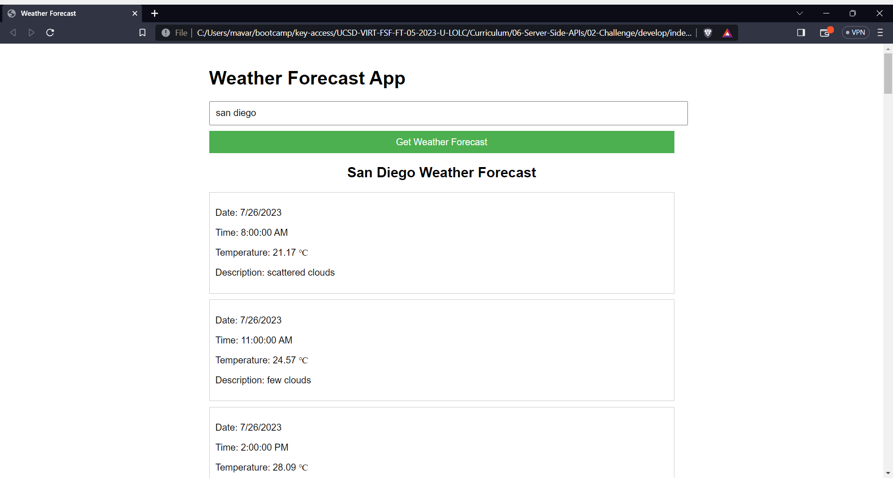

# Weather-Forecast

## Description

The Weather Forecast App is a user-friendly web application designed to provide accurate and up-to-date weather forecasts for cities worldwide. With a clean and intuitive interface, users can effortlessly retrieve weather information for their desired locations. All you need to do is visit the webpage right [here](mavarreteno.github.io/weather-forecast), type in the city that you need a weather forecast for, and click the button; and just like that, you will have a forecast of your desired city for the coming week. 
